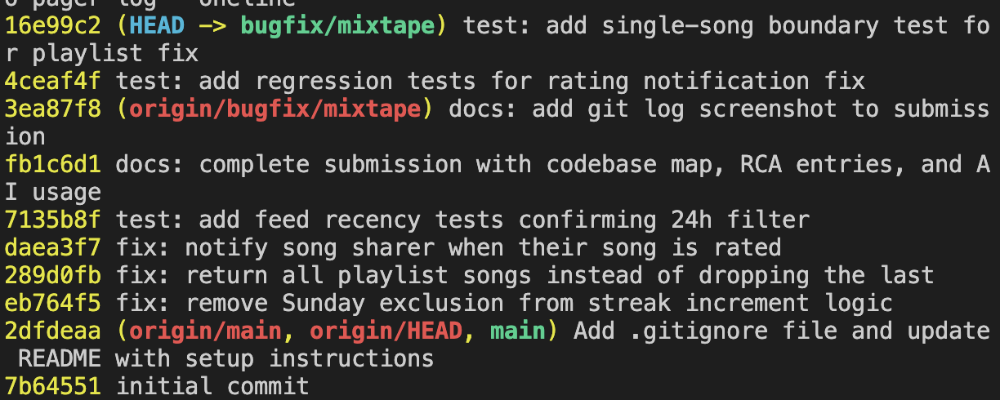

# Mixtape Bug Hunt — Submission

## AI Usage

I used Claude mostly for navigating code I hadn't written yet, not for generating fixes. Early on it helped me trace the write/read call chain for the feed feature and build the diagram in my codebase map. Later, during debugging, I used it to compare `add_to_playlist` against `rate_song` line by line for Issue #4, and to double-check the `weekday()` convention (Monday=0, Sunday=6) for Issue #1.

Two times it pushed me toward a fix that turned out to be wrong, and I only caught it because I tested before trusting it:

For Issue #3, an AI code review said the `song_tags` join would return a song once per tag and cause duplicates in search. I tried it in `flask shell` — searched a 3-tag song and a broad match — and got no duplicates at all (13 results, 13 unique ids). Turns out SQLAlchemy's identity map collapses the joined rows back to one object per song before returning them, so the duplication the AI described never actually happens at the ORM level. I didn't submit that "fix," since there was nothing to fix.

For Issue #2, AI review pointed at a naive-vs-aware datetime mismatch between the stored `listened_at` and the cutoff. I wrote `tests/test_feed.py` to force a 25-hour-old event through the real filter, and it was excluded correctly. The mismatch is real but doesn't cause the reported bug on SQLite — so again, no reproduction, no fix.

Both times the AI's read of the code was plausible but wrong once I actually ran it. That's the main thing this project taught me about using AI on unfamiliar code: it's good for explaining what's in front of it, worse at guessing what's broken before you've looked yourself.

---

## Milestone 1: Codebase Map

### Main files and their roles

- `models.py` — 7 models (`User`, `Tag`, `Song`, `ListeningEvent`, `Rating`, `Playlist`, `Notification`) plus 3 association tables: `friendships` (symmetric, `User`↔`User`), `song_tags` (`Song`↔`Tag`), and `playlist_entries` (`Playlist`↔`Song`, with an explicit `position` column — order isn't just insertion order). `Rating` has a unique constraint on `(user_id, song_id)`, and every PK is a UUID string, not an auto-increment int.
- `routes/songs.py` — song sharing, search, and rating routes, including `POST /songs/<song_id>/listen` (`listen()`), which pulls `user_id` from the request body and delegates to the streak service.
- `routes/feed.py` — feed endpoints: `GET /feed/<user_id>/listening-now` and `GET /feed/<user_id>/activity`.
- `routes/playlists.py` — playlist creation and song management.
- `routes/users.py` — user profiles, streaks, notifications.
- `services/streak_service.py` — `record_listening_event(user_id, song_id)` creates the `ListeningEvent` row and calls `update_listening_streak()` to bump/reset streak state; commits both together. **Issue #1** (streak resets) lives here.
- `services/feed_service.py` — `get_friends_listening_now()` (last-24h, deduped to one song per friend) and `get_activity_feed()` (most recent N events, no time filter, no dedup). **Issue #2** (stale "listening now") lives here.
- `services/search_service.py` — song search logic. **Issue #3** (duplicate search results) lives here.
- `services/notification_service.py` — notification creation/retrieval; validates song existence at `notify_song_rated()` — worth noting `record_listening_event` does *not* do the same validation (see Pattern below). **Issue #4** (missing rating notification) lives here.
- `services/playlist_service.py` — playlist retrieval logic. **Issue #5** (last playlist song missing) lives here.

### Data flow: a listen reaching a friend's feed

There is no `feed` table — feeds are computed on read from `ListeningEvent` rows. A listen recorded by one user surfaces in a friend's feed purely through the friendship relation queried at read time.

**Write path (a listen gets recorded):**
`POST /songs/<song_id>/listen` → `routes/songs.py: listen()` → `streak_service.record_listening_event(user_id, song_id)`
- loads the user (raises → 400 if not found)
- creates a `ListeningEvent(user_id, song_id, listened_at=now)`, added to the session
- calls `update_listening_streak(user, now)` to bump/reset `listening_streak` / `last_listened_at`
- `db.session.commit()` persists the event and the streak change together

**Read path (a friend's feed materializes):**
`GET /feed/<user_id>/listening-now` → `feed_service.get_friends_listening_now()` — reads friends' `ListeningEvent`s from the last 24h, deduped to the latest song per friend.
`GET /feed/<user_id>/activity` → `feed_service.get_activity_feed()` — reads friends' most recent N events, no time filter, no dedup.

```
User A listens                          User B views feed
──────────────                          ─────────────────
POST /songs/{id}/listen                 GET /feed/{B}/listening-now
   │                                        │
   ▼                                        ▼
record_listening_event(A, song)         get_friends_listening_now(B)
   ├─ new ListeningEvent(A, song) ─┐        │
   ├─ update_listening_streak(A)   │        ▼
   └─ commit                       │     query friends' events, last 24h
                                   │     dedup → one latest song per friend
                                   └────────►  A + song appear in B's feed
                          (linked only by the ListeningEvent row + B's friends list)
```

The write and read paths never call each other directly — they're joined only by the shared `ListeningEvent` row and the friendship relation.

### Patterns noticed

- **Routes delegate immediately to services.** Route functions parse the request and format the response; business logic lives in `services/`.
- **No feed table — feeds are derived on read.** This means a bug in either the write path (what gets recorded) or the read path (how it's filtered/deduped) can silently change what a user sees, with no single place to inspect "the feed" directly.
- **Inconsistent validation across services.** `notification_service.notify_song_rated()` validates the song exists before acting; `streak_service.record_listening_event()` does not — a bad `song_id` gets stored and only fails later, at read time, when `feed_service` calls `.to_dict()` on a missing song.
- **Explicit ordering, not insertion order.** `playlist_entries` stores a `position` column rather than relying on row order — any playlist read logic that doesn't sort by `position` (or mishandles the boundary of that ordering) is a likely home for Issue #5.
- **UUID string PKs everywhere.** Every model uses `default=generate_uuid` string PKs rather than auto-increment ints — worth remembering if any bug involves comparing or looking up IDs.

### AI disclosure

Used AI assistance to trace the write/read call chain for the listening-feed feature and to generate the accompanying diagram, based on reading `routes/songs.py`, `routes/feed.py`, `services/streak_service.py`, and `services/feed_service.py`.

---

## Milestone 3: Root Cause Analyses

### Issue #1 — My listening streak keeps resetting
1. **Issue:** #1 — My listening streak keeps resetting (`streak_service.py`)
2. **How reproduced:** Ran `pytest tests/test_streaks.py`: `test_streak_increments_on_sunday` failed with `assert 1 == 2` (Saturday listen → 1, Sunday listen expected 2, got 1). Also confirmed live via `flask shell` on seeded user `darius` (streak 3, last listened yesterday) — a listen today reset him to 1 instead of 4.
3. **How root cause found:** Read `update_listening_streak()` in `streak_service.py`. The consecutive-day branch carried `and today.weekday() != 6`; since `weekday()` returns 6 for Sunday, this line suppresses the increment on Sundays. The test's name confirmed it.
4. **Root cause:** The increment branch read `elif days_since_last == 1 and today.weekday() != 6:`. On Sundays that condition is false, so a valid consecutive-day listen fell through to the `else` and reset the streak to 1. Every other day worked, making it look intermittent.
5. **Fix + side-effect check:** Removed the `and today.weekday() != 6` clause, leaving `elif days_since_last == 1:`. All 5 streak tests now pass, including the Sunday case; the other branches (first listen, same-day, gap > 1 day) still behave correctly. Committed as `fix: remove Sunday exclusion from streak increment logic` (`eb764f5`).

### Issues #2 and #3 — investigated, not fixed (three-bug scope)
I chose to fix three bugs (#1, #4, #5). I also investigated #2 (stale feed) and #3 (duplicate search) but could not reproduce either after genuine attempts, so — per the brief's guidance to "try a different one from the list" when a bug won't reproduce — I did not submit fixes for them. Notes on what I found are in the AI usage section at the top.

### Issue #4 — Missing notification when a friend rates my song
1. **Issue:** #4 — Notified when a friend adds my song to a playlist, but not when they rate it (`notification_service.py`)
2. **How reproduced:** In `flask shell`, counted the sharer's notifications, called `rate_song(rater_id, song_id, 5)` for a song shared by someone else, then re-counted. Count stayed at `before: 1, after: 1` — the rating saved but no notification was created.
3. **How root cause found:** Compared the two sibling functions in `notification_service.py`. `add_to_playlist` ends by calling `create_notification(...)` for the song's sharer; `rate_song` ends with `db.session.commit(); return rating` and never calls `create_notification` at all. The missing call — not a typo, but an absent step — was the cause.
4. **Root cause:** `rate_song` was never wired to notify. The playlist path notifies the sharer; the rating path only persists the `Rating` and returns. So rating another user's song produced no `song_rated` notification, while the playlist path worked.
5. **Fix + side-effect check:** Added a `create_notification(...)` call at the end of `rate_song`, mirroring `add_to_playlist` — including the self-check `if song.shared_by != user_id` so a user isn't notified for rating their own song. Re-ran the reproduction: count now goes `before: 1, after: 2`. Rating logic itself (score validation, update-existing-rating) is unchanged, so no other behavior was affected. Added `tests/test_notifications.py` to cover both the fix and the self-rating side effect.

### Issue #5 — The last song in a playlist never shows up
1. **Issue:** #5 — The last song in a playlist never shows up (`playlist_service.py`)
2. **How reproduced:** Ran `pytest tests/test_playlists.py`: `test_playlist_returns_all_songs` failed with `assert 4 == 5` (5 songs seeded, only 4 returned), and `test_playlist_returns_songs_in_order` failed missing the final `Track 5` — two symptoms of the same bug.
3. **How root cause found:** Read `get_playlist_songs()` in `playlist_service.py`. The query itself is correct (joins `playlist_entries`, orders by `position`, `.all()`), so the loss had to be after the query. The return line sliced the results with `songs[:-1]`. The docstring says the function "returns all songs," so code and stated intent disagreed — confirming the slice was the cause.
4. **Root cause:** The return statement was `[song.to_dict() for song in songs[:-1]]`. The `[:-1]` slice drops the last element, so the highest-`position` song was always excluded before returning.
5. **Fix + side-effect check:** Changed the slice to the full list: `[song.to_dict() for song in songs]`. Both playlist tests now pass, confirming all songs return in correct position order. Added a single-song playlist test to `tests/test_playlists.py` as a boundary check — the old slice would have returned an empty list for a one-song playlist. Committed as `fix: return all playlist songs instead of dropping the last`.

---

## Commit History

One commit per fix on `bugfix/mixtape`, plus regression test commits:

